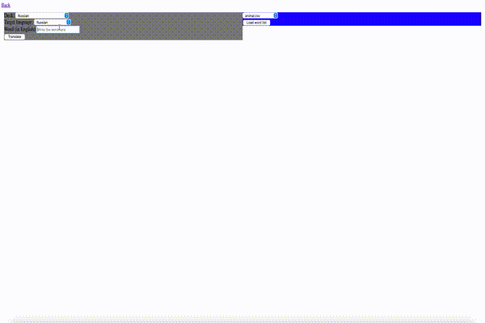

# ForeignLanguageCompanion

This project aims to be a automated companion to your language learning endeavours. It is heavily based on the practices of the book Fluent Forever and technically inspired by
[FluentForeverVocabBuilder](https://github.com/cofinley/FluentForeverVocabBuilder). I decided to make my own project as I was too lazy to work around a forked code and
thought that other features could be implemented as well.



## Implemented Features

So far, the project was only tested on Linux and MAC. 

1. Word cards
2. Pronunciation cards

## Features to come
3. Sentence cards

# Tutorial

## Prerequisites

In order for this project to work, you will need [Anki](https://apps.ankiweb.net/), [AnkiConnect](https://ankiweb.net/shared/info/2055492159)
and [Python](https://docs.conda.io/en/latest/miniconda.html). You will also need the
[model deck](http://fluent-forever.com/downloads/Model-Deck-May-2014.apkg.zip) from Fluent Forever. Add it inside your Anki software.
Once all of these are installed, please run this to install all the required python modules.


```shell
pip install -r requirements.txt
```

## Step-by-step
1. Open Anki
2. Download the repo (type the following instructions in your terminal)
```
git clone https://github.com/truvaking/ForeignLanguageCompanion.git
```
4. Go into the repo root directory
```
cd ForeignLanguageCompanion
```
5. Run this
```shell
chmod +x ./start.sh
./start.sh
```
3. On your browser, go to this url : http://127.0.0.1:5001/

## Vocabulary

The vocabulary part of this project allows you to add words from english to your target language (currently it's only in German).
The process goes like this :
1. Choose the Anki Deck that will receive the new cards
1. Type your word in English
2. Choose the translation that fits your needs
3. Choose related info such as IPA, Word Usage, Recording, or Images.
4. Click add and they will arrive into your Anki Deck

### Bulk Vocabulary

You can also load a .csv file that contains a list of word that you wish to learn. For my personal use, I categorized them by semantic category (animals, clothing, etc.)
On the right panel, you can :
1. Select a word list
2. Then a bunch of buttons will apear, click one of them and it will automatically be written in the input on the left
3. The button disappears after you clicked it

## Pronunciation
The pronunciation part of this project allows you to add words from the target language and create card to focus on specific words or group of words
The process goes like this :
1. Choose the Anki Deck that will receive the new cards
1. Type your word in the target language
3. Choose related info such as IPA, Recording, or Images.
4. Click add and they will arrive into your Anki Deck

## Sentences
WIP

# API use for Advanced Users

You can provide your API keys from the Microsoft Azure Cloud services to improve some results and/or their availability.

WIP

# Issue

This is still a buggy project. Please let me know of any issues in the issues section. You should expect a lot of problem, especially if you do not have API keys.
You should also expect some rare cases where there is no bug but the result is still not what you expect. This is due to the undeterministic
nature of natural language. Personally, I found these cases to be rare enough to not be bothered by it.

# Supported Languages

Many languages are supported, but I don't really know which one actually is. It boils down to the intersection of languages supported by Microsoft's Translator and Wiktionary.
At the current state, you should expect languages with non-latin alphabet to work relatively worse than languages with latin alphabet. 
